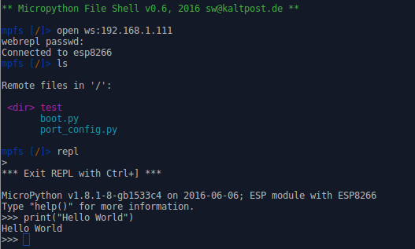

# mpfshell
2016-06-03, sw@kaltpost.de

A simple shell based file explorer for ESP8266 and WiPy 
[Micropython](https://github.com/micropython/micropython) based devices.

The shell is a helper for up/downloading files to the ESP8266 (over serial line and Websockets) 
and WiPy (serial line and telnet). It basically offers commands to list and upload/download 
files on the flash FS of the device.

Main features:

* Support for serial connections (ESP8266 and WiPi)
* Support for websockets (via WebREPL) connections (ESP8266 only)
* Support for telnet connections (WiPy only)
* Full directory handling (enter, create, remove)
* Transfer (upload/download) of multiple files matching a reg.-exp.
* All files are transferred in binary mode, and thus it should be 
  possible to also upload pre-compiled code (.mpy) too.
* Integrated REPL (supporting a workflow like: upload changed files, enter REPL, test, exit REPL, upload ...)
* Fully scriptable
* Tab-completion
* Command history
* Best of all: it comes with color

__Note__: The software is tested on Ubunto 16.04 LTS.

## Requirements

General:

* ESP8266 or WiPy board running latest [Micropython](https://github.com/micropython/micropython)
* For the ESP8266 firware build from the repository, please not, that WebREPL is not started
  by default. For more information see the [quickstart](http://micropython.org/resources/docs/en/latest/esp8266/esp8266/quickref.html#webrepl-web-browser-interactive-prompt).
* For the WiPy, please note, that you need to enable REPL on UART if you intend to connect
  via serial line to the WiPy (see [here](http://micropython.org/resources/docs/en/latest/wipy/wipy/tutorial/repl.html))

For the shell:

* Python 2.7
* The PySerial library >= 3.0 (sudo pip install pyserial)
* The colorama library >= 0.3.6 (sudo pip install colorama)
* The websocket-client library >= 0.35.0 (sudo pip install websocket-client)

__Note__: The tools only works if the REPL is accessible on the device!

## Installing

To install this tool execute the following:

	sudo pip install pyserial
    sudo pip install colorama
    sudo pip install websocket-client
    sudo python setup.py install
    
## General

The shell supports TAB completion for commands and file names.
So it totally is worth it pressing TAB-TAB every now and then :-)
    
## Shell Usage

Start the shell with:

    mpfshell

At the shell prompt, first connect to the device. E.g. to connect 
via serail line:

    mpfs> open ttyUSB0
    
Or connect via websocket (ESP8266 only):

    mpfs> open ws:192.168.1.1,python
    
Or connect vial telnet (WiPy only):

    mpfs> open tn:192.168.1.1,micro,python
    
__Note__: Login and password are optional. If left out, they will be asked for. 

Now you can list the files on the device with:

    mpfs> ls

To upload e.g. the local file "boot.py" to the device use:

    mpfs> put boot.py

If you like to use a different filename on the device, you could use this:

    mpfs> put boot.py main.py

Or to upload all files that match a regular expression from the 
current local directory to the current remote directory:

    mpfs> mput .*\.py

And to download e.g. the file "boot.py" from the device use:

    mpfs> get boot.py
    
Using a different local file name:

    mpfs> get boot.py my_boot.py

Or to download all files that match a regular expression from the 
current remote directory to the current local directory:

    mpfs> mget .*\.py

To remove a file (or directory) on the device use:

    mpfs> rm boot.py

Or remove all remote files that match a regular expression:

    mpfs> mrm test.*\.py

To create a new remote directory:

    mpfs> md test

To navigate remote directories:

    mpfs> cd test
    mpfs> cd ..
    mpfs> cd /some/full/path
    
See which is the current remote directory:

    mpfs> pwd

Remove a remote directory:

    mpfs> rm test
    
__Note__: The directory to delete needs to be empty!

To navigate on the local filesystem, use:

    lls, lcd lpwd

Enter REPL:

    repl
    
To exit REPL and return to the file shell use Ctrl+Alt+] 

For a full list of commands use:

    mpfs> help
    mpfs> help <command>

The shell is also scriptable.

E.g. to execute a command, and then enter the shell:

    mpfshell -c "open ttyUSB0"
    
Or to copy the file "boot.py" to the device, and don't enter the shell at all:

    mpfshell -n -c "open ttyUSB0; put boot.py"

It is also possible to put a bunch of shell commands in a file, and then execute
them from that file.
 
E.g. creating a file called "myscript.mpf":

    open ttyUSB0 
    put boot.py
    put main.py
    ls
    
And execute it with:

    mpfshell -s myscript.mpf    
